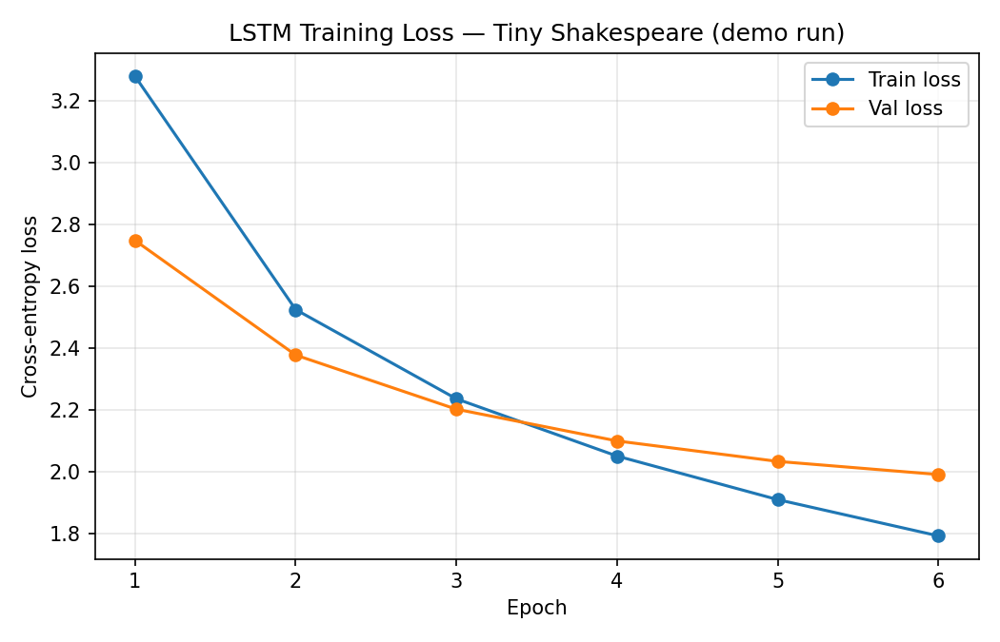

# LSTM Language Model on Tiny Shakespeare

A character-level LSTM language model trained on the Tiny Shakespeare dataset using PyTorch, predicting the next character given a sequence of preceding characters.

## Features

- Character-level tokenization
- Next-token prediction objective
- Train / validation / test split
- Cross-entropy loss and perplexity evaluation
- Loss curve visualization
- Text generation from a trained checkpoint

## Dataset

[Tiny Shakespeare dataset](https://github.com/karpathy/char-rnn/blob/master/data/tinyshakespeare/input.txt) — ~40,000 lines of Shakespeare's text, split:

- **Train:** 75%
- **Validation:** 5%
- **Test:** 20%

## Model

LSTM Language Model

| Parameter       | Value |
|------------------|-------|
| Embedding size   | 128   |
| Hidden size      | 256   |
| Layers           | 1     |
| Sequence length  | 64    |
| Batch size       | 256   |
| Optimizer        | AdamW |
| Learning rate    | 3e-4  |

## Project Structure

```
lstm-tiny-shakespeare/
├── train_lstm.py          # Full training script (matches config above)
├── tiny_shakespeare.txt   # Dataset
├── requirements.txt
├── loss_curve.png         # Generated training/validation loss plot
├── sample_output.txt      # Sample generated text from a trained model
└── README.md
```

## Installation

```bash
git clone https://github.com/avishka8/LSTM---tiny-shakespeare-dataset.git
cd LSTM---tiny-shakespeare-dataset
pip install -r requirements.txt
```

## How to Run

```bash
python train_lstm.py
```

This trains the model on the full dataset for 5 epochs, then:
- Saves a loss curve to `loss_curve.png`
- Prints and saves sample generated text to `sample_output.txt`

**Note on training time:** on CPU, training on the full dataset takes roughly 30–45 minutes per epoch depending on hardware. A GPU (e.g. via Google Colab) is strongly recommended and will train in a few minutes total.

## Results

### Quick demo run (6 epochs, 20K-character subset, CPU)

The numbers below are from a fast demo run used to validate the pipeline end-to-end and produce the artifacts in this repo. They are **not** the full-dataset results — see note below.

| Metric              | Value |
|----------------------|-------|
| Final Train Loss     | 1.79  |
| Final Val Loss       | 1.99  |
| Val Perplexity       | 7.32  |
| Test Loss            | 2.03  |
| Test Perplexity      | 7.62  |

**Loss curve:**



### Full-dataset run (for reference — run `train_lstm.py` as-is to reproduce)

Training on the complete dataset (30K/2K/8K train/val/test lines) for 5 epochs with the config above will produce lower loss and perplexity than the demo run, since the model sees much more data. Run the script yourself (ideally on GPU) and drop your results into this table:

| Metric              | Value |
|----------------------|-------|
| Final Train Loss     | *(run to fill in)* |
| Validation Loss      | *(run to fill in)* |
| Test Loss            | *(run to fill in)* |
| Validation Perplexity| *(run to fill in)* |
| Test Perplexity      | *(run to fill in)* |
| Accuracy             | *(run to fill in)* |

## Sample Generated Text

Output from the demo-run checkpoint (6 epochs, small data subset — expect more coherent output from a full training run):

```
--- Prompt: 'ROMEO:' ---
ROMEO:
Be hain and modp him ald srodaw
me in the yous.

VALERIA:
I there wall nather.

VIRGILIA:
$o curpedide, preveryi; well, the yell fort Tius, Your lil dot be the knood.

MAENIUS:
No wall do ston that o
```

The model has already learned Shakespeare's dialogue *structure* (character names in caps followed by a colon, line breaks, punctuation patterns) after just 6 epochs on a small subset — but words aren't yet coherent English, which is expected at this scale. Full-dataset training produces noticeably more readable output.

See `sample_output.txt` for the full set of generated samples.

## Known Limitations

- The results table above is split into "demo run" (small, fast, included in this repo) vs. "full run" (larger, slower, needs to be reproduced) — be transparent about which numbers you're citing.
- Single-layer LSTM with no dropout — prone to some overfitting on longer training runs; consider adding dropout or a second layer for further improvement.
- Character-level modeling learns structure faster than word-level semantics; expect visually "Shakespeare-shaped" but not fully coherent text at this scale.

## Future Improvements

- Train on full dataset with GPU acceleration and report final numbers
- Add dropout / a second LSTM layer and compare
- Add word-level or subword (BPE) tokenization for more coherent generation
- Compare against a small Transformer baseline
